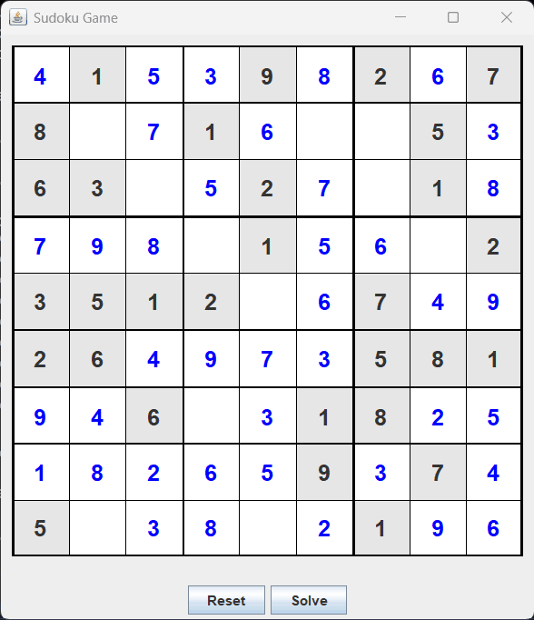

# Sudoku
Class Sudoku contains methods useful to generate and solve Sudoku games; it can be launched as standalone app to perform benchmarking tests of the implemented solvers.
Class SudokuGame is an interactive Swing app to play with Sudoku.

Note: ordinary values are in 1..9 range, value 0 is used for a free place

## Methods
The following methods are provided to generate and solve Sudoku games:
| Method | Description |
|--------|-------------|
| `generate(int n_values)` | random sudoku board generator with unique solution and at least n_values |
| `solve()` | solve the sudoku board |
| `solveBM()` | solve the sudoku board using bitmap for speed improvement |
| `fastsolveBM()` | solve the sudoku board using bitmap and forbidden tables for speed improvement |
| `solveDLX()` | solve the sudoku board using DLX Sudoku solver developed by Shivan Kaul Sahib |
| `parseBoard(String str)` | unpack string to board |

## Usage of sudoku solver from command line
```
Usage: java -cp classes solver.Sudoku [-benchmark | -check | <board>]

without parameters: it runs random tests forever
with parameters:
-benchmark: performs benchmark using a specific set of boards
-check: check that all solvers return same result for a specific set of boards
<board>: 81 characters string defining a Sudoku board, e.g. 000000012000000003002300400001800005060070800000009000008500000900040500470006000
```

## Running interactive sudoku game
``SudokuGame`` is an interactive java Swing app to play Sudoku game, it uses ``fastsolveBM`` method to solve the game
```
Usage: java -cp classes game.SudokuGame
```
Try ``SudokuGame`` using the browser without downloading anything using the *SnapCode* tool: [SudokuGame via SnapCode](https://reportmill.com/SnapCode/app/#open:https://github.com/javalc6/sudoku.zip#/game/SudokuGame.java)

## Solution example

Executing the command ``java -cp classes solver.Sudoku 000000012000000003002300400001800005060070800000009000008500000900040500470006000`` provides the following output:

```
000|000|012
000|000|003
002|300|400
---+---+---
001|800|005
060|070|800
000|009|000
---+---+---
008|500|000
900|040|500
470|006|000
#values = 21, isFull = false, isCorrect = true
Solution found in 1.1505 ms:
839|465|712
146|782|953
752|391|486
---+---+---
391|824|675
564|173|829
287|659|341
---+---+---
628|537|194
913|248|567
475|916|238
#values = 81, isFull = true, isCorrect = true
```
## Benchmarking different algorithms
Executing the command ``java -cp classes solver.Sudoku -benchmark`` may provide the following output running on CPU AMD Ryzen 7 8845HS:

```
Benchmarking solve()
Average solver time: 9.066690615384616 ms
Max solver time: 173.9068 ms, running benchmark 48.3............71.2.......7.5....6....2..8.............1.76...3.....4......5....
----------------------
Benchmarking solveBM()
Average solver time: 4.016155948717949 ms
Max solver time: 68.8113 ms, running benchmark 48.3............71.2.......7.5....6....2..8.............1.76...3.....4......5....
----------------------
Benchmarking fastsolveBM()
Average solver time: 0.4828485641025641 ms
Max solver time: 8.1644 ms, running benchmark 48.3............71.2.......7.5....6....2..8.............1.76...3.....4......5....
----------------------
Benchmarking solveDLX()
Average solver time: 0.6058199487179486 ms
Max solver time: 7.2324 ms, running benchmark .........6..4..1...47..2.6.8.6........93..8.2....84..7...7...863...267..........1
```
## Screenshot
Sudoku game:



# Credits
The author of DLX Solver implementation is Shivan Kaul Sahib, [Sudoku-DLX](https://github.com/ShivanKaul/Sudoku-DLX)

A subset of the list of sudoku boards is from https://magictour.free.fr/sudoku.htm